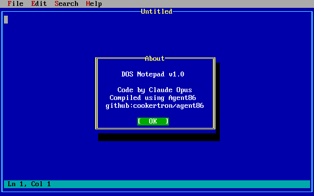

# DOS Notepad

A full-featured text editor for DOS, written in 8086 assembly. Runs in CGA text mode (80x25) on real hardware or in DOSBox-X.



## Features

- **Gap buffer engine** for fast insert/delete at cursor
- **File I/O** — New, Open, Save, Save As with CR/LF handling
- **Text selection** — Shift+arrow keys, click+drag, Shift+click
- **Clipboard** — Cut, Copy, Paste with internal 8KB buffer
- **Find & Replace** — forward case-sensitive search, F3 to repeat
- **Undo/Redo** — full operation history with Ctrl+Z / Ctrl+Y
- **Mouse support** — click to position, drag to select, shift+click to extend
- **Menu system** — Alt+key shortcuts, dropdown hotkeys
- **Status bar** — line/column display, modified indicator

## Keyboard Shortcuts

| Shortcut | Action |
|----------|--------|
| Ctrl+N | New file |
| Ctrl+O | Open file |
| Ctrl+S | Save |
| Ctrl+Z | Undo |
| Ctrl+Y | Redo |
| Ctrl+X | Cut |
| Ctrl+C | Copy |
| Ctrl+V | Paste |
| Ctrl+A | Select All |
| Ctrl+F | Find |
| F3 | Find Next |
| Ctrl+R | Replace |
| Home / End | Start / end of line |
| Page Up / Down | Scroll by page |
| Shift+arrows | Extend selection |
| Alt+F/E/S/H | Open menu |

## Building

Requires [Agent86](https://github.com/cookertron/agent86), an 8086 assembler and emulator.

```
agent86.exe notepad.asm
```

This produces `notepad.com`, a DOS .COM executable (~60KB).

## Running

Run in DOSBox-X or any DOS-compatible environment:

```
notepad.com
```

Or test with the Agent86 emulator:

```
agent86.exe notepad.com --run
```

## Architecture

The editor is built on a custom TUI (Text User Interface) framework providing windows, controls, menus, dialogs, and mouse support. The text buffer uses a gap buffer data structure for O(1) insert/delete at the cursor.

| Component | File | Description |
|-----------|------|-------------|
| Main program | `notepad.asm` | Entry point, menus, window setup |
| Editor control | `editor_ctrl.inc` | Paint, key handler, status bar, mouse |
| Gap buffer | `editor_gap.inc` | Text storage and cursor movement |
| File I/O | `editor_file.inc` | New, Open, Save, Save As |
| Clipboard | `editor_clip.inc` | Cut, Copy, Paste |
| Find/Replace | `editor_find.inc` | Search and replace |
| Undo/Redo | `editor_undo.inc` | Operation history |
| Constants | `editor_const.inc` | Shared definitions |
| TUI framework | `TUI/` | 11 .inc files (~7,700 lines) |

## Credits

- Code by Claude Opus
- Compiled using [Agent86](https://github.com/cookertron/agent86)
